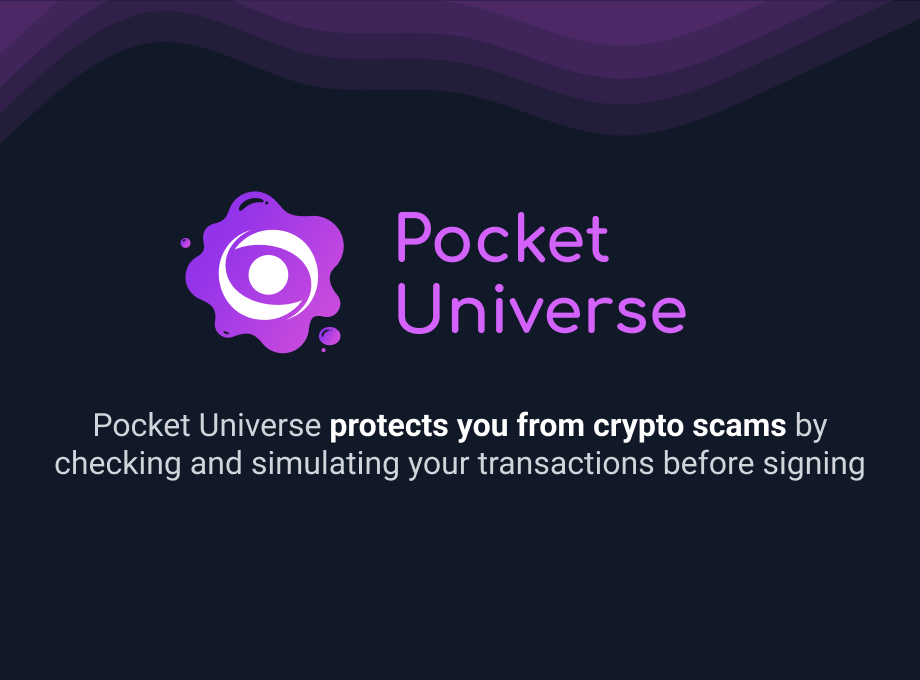

# PocketUniverse

# Layout

## Injected

The injected script proxies requests from the website to PocketUniverse before forwarding it to
`window.ethereum`.

We don't modify the request but rather just wait until the user decides it wants to continue.

We communicate our requests with the content-script through the DOM.

## ContentScript

This is responsible for communicating with the webpage. It takes the webpage request and stores it
in local storage for the service worker to pick it up.

## Background

This service worker handles the requests and popup triggering logic.

It listens to changes in storage and forwards requests if there are new things to simulate.

## Popup

This is what the user sees when there is a simulation in progress. This simply uses the storage
state to be displayed.

It will write to storage the action the user decides to take.

## Contributions

If you'd like to contribute, feel free to pop in the discord or DM us on twitter. I'd be happy to
chat :D

## Contact Us

- [Twitter](https://twitter.com/PocketUniverseZ)
- [Discord](https://discord.gg/UrgqjUQFH2)
