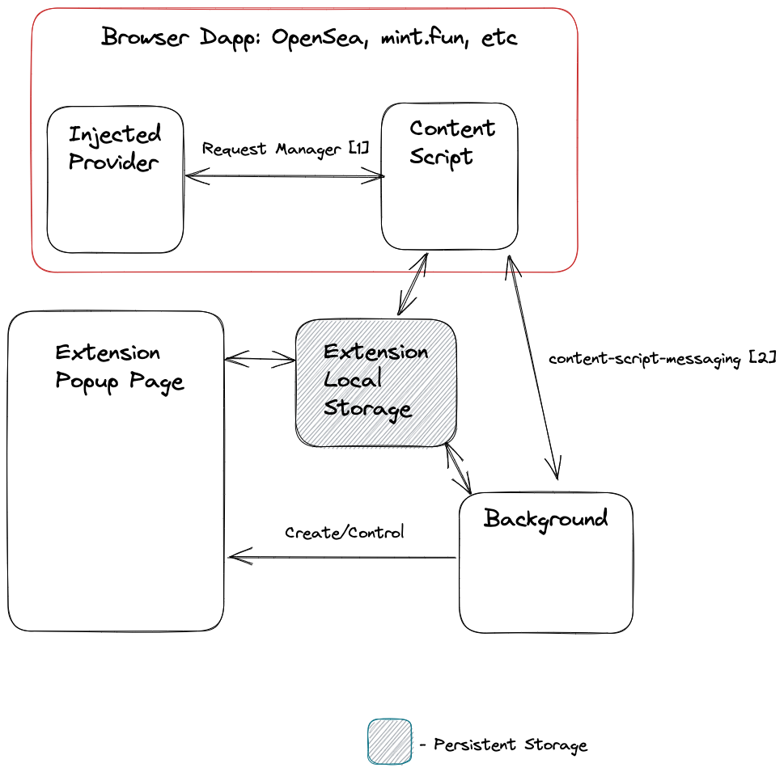

This is a [Plasmo extension](https://docs.plasmo.com/) project bootstrapped with [`plasmo init`](https://www.npmjs.com/package/plasmo).

## Getting Started

First, run the development server:

```bash
pnpm dev
```

For further guidance, [visit our Documentation](https://docs.plasmo.com/)

## Making production build

Run the following:

```bash
pnpm build
# or
npm run build
```

This should create a production bundle for your extension, ready to be zipped and published to the stores.

## Submit to the webstores

The easiest way to deploy your Plasmo extension is to use the built-in [bpp](https://bpp.browser.market) GitHub action. Prior to using this action however, make sure to build your extension and upload the first version to the store to establish the basic credentials. Then, simply follow [this setup instruction](https://docs.plasmo.com/framework/workflows/submit) and you should be on your way for automated submission!

## Safari

We need to target MV2 first

```bash
pnpm run build:plasmo
```

We need to manually go into `build/chrome-mv2-dev/manifest.json` set

```json
{
  "background": {
    "persistent": false
  }
}
```

to ensure this works with iOS.

We now need to generate the xcode directory

```bash
xcrun safari-web-extension-converter ./chrome-mv2-prod --project-location ../artifacts  --app-name PocketUniverse --bundle-identifier com.refract.PocketUniverse --ios-only --copy-resources
```

Open up this project and build, you may need to assign a signer each time.

# Architecture



## [1] Request Manager

The request manager handles communication from the injected provider (in the main world) and the content script (still in the webpage).
We need to do this jump because we cannot access `chrome.*` APIs from within the main world.

This request manager is just a simple mapping between promises and uuids. It is not type safe so should be a little cautious. We should also minimize dependencies here since it is used in the browser itself.

This is bi-directional as the injected script may request data but this bidirectional channel isn't used (it is client <-> server for now).

## [2] Content Script Messaging

Content Script Messaging handles communication between the content script and the background service. It uses a chrome port underneath but for type safety we use TRPC (well for now it's mostly for ease, we'll see if it's too heavy of a dependency).

This is a typical client<->server relationship. The background script will just respond to requests.

## Extension Local Storage

The tab page handles requests through extension storage. The flow is as follows:

1. ContentScript stores a request in extension storage
2. Background script takes that new requests, simulates it and writes it back to extenseion storage.
3. Popup listens to extension storage and displays results. User decides to reject/continue. This is stored back in local storage.
4. The content script listens to extension storage user response and sends it back to the webpage.

# Sentry
We have sentry browser in the background script which will alert all errors. This won't correlate it to user unfortunately since we don't have datadog there.
